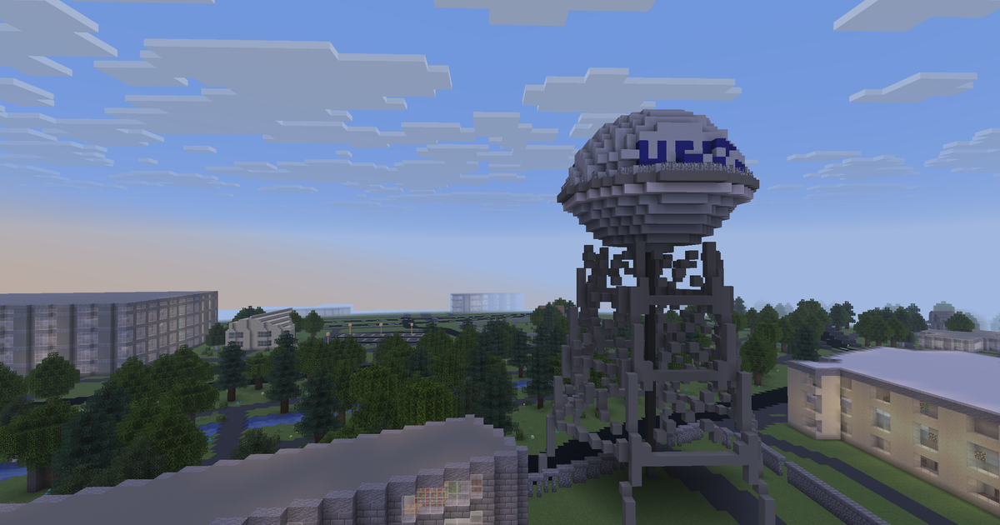
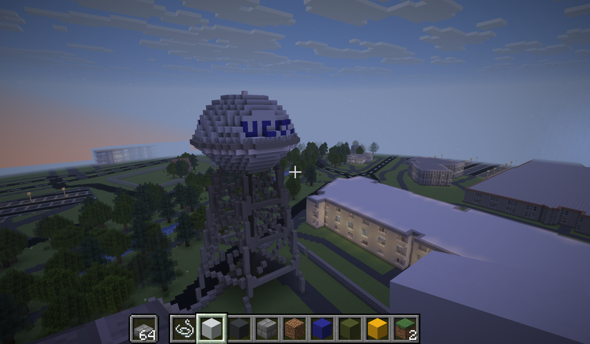

# BuildDavis

**The entire city of Davis, California — rebuilt block-by-block in Minecraft at 1:1 scale.**

Real LiDAR terrain. Real building heights. Real bike paths. Real valley oaks. Every structure placed from actual geodata — and hand-finished by people who know this town.

## Connect

| Platform | Address | Port |
|----------|---------|------|
| **Java Edition** | `builddavis.world` | `25606` |
| **Bedrock** (Mobile / Switch / Xbox) | `builddavis.world` | `25606` |

## Screenshots

  
  

  
  

## World Stats

| Metric | Value |
|--------|-------|
| Total blocks | ~3.0 billion |
| Buildings | ~20,000 |
| Trees | 48,000 |
| Road segments | 7,000 |
| Bike paths | 100 miles |
| Iconic landmarks | 13 hand-built |

## How It Works

BuildDavis uses a 6-stage geospatial ETL pipeline to convert real-world data into Minecraft:

1. **Fetch** — Pull building footprints, roads, trees, and infrastructure from OpenStreetMap, Overture Maps, USGS LiDAR, and City of Davis GIS
2. **Parse** — Extract and classify 94,000+ geographic elements
3. **Fuse** — Merge overlapping data sources with priority rules (Davis GIS > LiDAR > Overture > OSM)
4. **Enrich** — Validate building heights, inject facade colors, apply zone-specific material palettes
5. **Adapt** — Transform enriched geodata into block placement instructions
6. **Render** — Generate Minecraft Java Edition region files (.mca) with 15-block bedrock depth, interior generation, and roof shapes

Iconic landmarks (Water Tower, Amtrak Station, Stadium, Carousel, Egghead sculptures, etc.) are hand-built using a custom StructureBuilder → NBT pipeline and placed at their real GPS coordinates.

## Contribute

**Two ways to help — no Minecraft required for the first:**

### 🗺️ Map Davis (No Minecraft needed)
Add real-world detail to [OpenStreetMap](https://www.openstreetmap.org/edit#map=16/38.5449/-121.7405) — benches, bike racks, trees, shop names. Your edits automatically appear in the next world generation.

### 🔨 Build Davis (Minecraft builders)
Apply for builder access at [builddavis.org](https://builddavis.org/#apply). Claim a zone, get the style guide, and make your neighborhood look exactly like the real thing.

## Tech Stack

- **World generation:** Custom Python pipeline (fetch → parse → fuse → adapt → render)
- **Render engine:** Rust-based .mca region file generator
- **Terrain:** USGS 3DEP LiDAR (1m resolution DEM)
- **Data sources:** OpenStreetMap, Overture Maps, City of Davis GIS, UC Davis Tree Database
- **Server:** Paper 1.21.4 + GeyserMC (cross-platform Java + Bedrock)
- **Hosting:** Apex Hosting
- **Website:** Static HTML on GitHub Pages at [builddavis.org](https://builddavis.org)

## Placed Landmarks

| Landmark | Type |
|----------|------|
| UC Davis Water Tower | 48-block tall elevated tank with "UC DAVIS" lettering |
| Davis Amtrak Station | Mission Revival architecture, arched colonnade |
| UCD Health Stadium | Full oval track, bleachers, end zones, goal posts |
| Varsity Theatre | Art Deco marquee on 2nd Street |
| Toad Tunnel | Toad Hollow art installation |
| Manetti Shrem Museum | Grand Canopy with 68 columns, two pavilions |
| Flying Carousel | Octagonal pavilion with hand-carved animals |
| 7 Egghead Sculptures | Yin & Yang, Bookhead, See/Hear No Evil, Eye on Mrak, Stargazer |

## License

This project is a fork with significant modifications. See [LICENSE](LICENSE) for details.

## Links

- **Website:** [builddavis.org](https://builddavis.org)
- **Discord:** [discord.gg/Rt7c6Jje](https://discord.gg/Rt7c6Jje)
- **Server:** `builddavis.world:25606`
